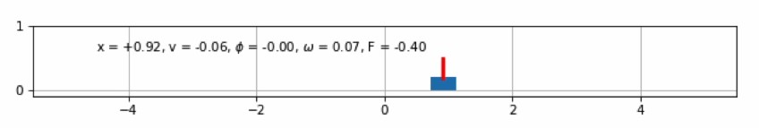

# Inverted Pendulum Control

The classic inverted pendulum, where you must move a cart to keep the pendulum in a vertical position.

* state vars = [`x`, `v`, `theta`, `omega`] with `x` [m] and `v` [m/s] the position and velocity of the cart, and `theta` and `omega` the angle [rad] and angular velocity [rad/s] of the pendulum with respect to the vertical.
* input = a force `F` [N] applied to the cart
* limits on input: -10 < `F` < 10

## File description

* [InvertedPendulum.m](https://github.com/AlexVanMechelen/arduino/blob/master/InvertedPendulum.m) :  All-in-one easy to run recap file
* [InvertedPendulum.mp4](https://github.com/AlexVanMechelen/arduino/blob/master/InvertedPendulum.mp4) :  Video of a full run of InvertedPendulum.m
* [Plot.m](https://github.com/AlexVanMechelen/arduino/blob/master/Plot.m) :  Used for making the majority of the plots for the presentation
* [StateSpace.mlx](https://github.com/AlexVanMechelen/arduino/blob/master/StateSpace.mlx) :  Used to model our controllers + documentation of the process
* [Plots-Video/README.txt](https://github.com/AlexVanMechelen/arduino/blob/master/Plots-Video/README.txt) :  Comments on some of the plots in Plots-Video
* [Controller.py](https://github.com/AlexVanMechelen/arduino/blob/master/controller.py) :  Main python file used for the control
* [src/Pendulum.py](https://github.com/AlexVanMechelen/arduino/blob/master/src/pendulum.py) :  Contains the nonlinear pendulum model
* [Block Diagrams](https://github.com/AlexVanMechelen/arduino/tree/master/Diagrammen) : Contains block diagrams of the used controlled systems
* [closeSessions.bat](https://github.com/AlexVanMechelen/arduino/blob/master/closeSessions.bat) :  For an easy run of the Python simulations just using Matlab (ONLY FOR WINDOWS)
